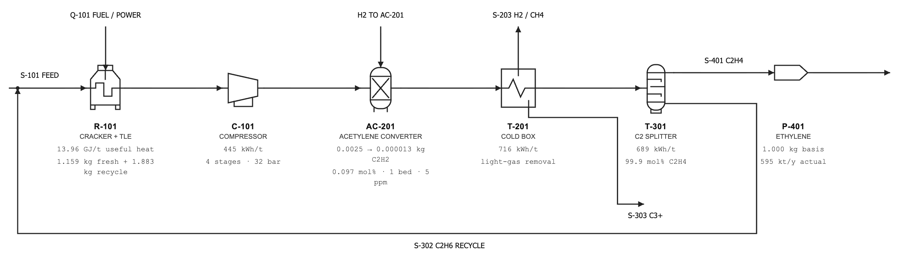

# PFD display revision

September 22, 2026 interface revision. Numerical values below describe that revision.

The subsequent monochrome revision follows the visual conventions in the user-supplied [P&ID/PFD symbol reference](https://hardhatengineer.com/wp-content/uploads/2017/09/PID-Symbols.pdf), especially pages 6–9: outline equipment, consistent strokes, nozzle connections, and a trayed column. These are simplified PFD symbols; the cold box and combined cracker/TLE remain aggregate model blocks. No instrumentation or numerical equipment detail was added. The updated interface again passes all 70 existing UI checks.

Replaced fixed-coordinate routing with measured equipment ports. Stream arrows keep a constant size; orthogonal branches and the recycle junction remain attached when the viewport changes. Equipment values sit below the pipe routes. The diagram keeps a 1040-pixel minimum canvas and scrolls within its panel on narrow screens.

Only `index.html` presentation and layout code changed. The engine and numerical data are unchanged. Existing UI audit: 70 checks passed. Reference-case cost (505.5532935451966 USD/t), carbon (1672.7661776577452 kg/t), and conversion (0.38101944001068216) match the live release. At a 700-pixel viewport the document remains 700 pixels wide, with scrolling confined to the diagram panel. The final desktop diagram was visually checked for disconnected arrows, clipped outlets, and pipe/label collisions.

